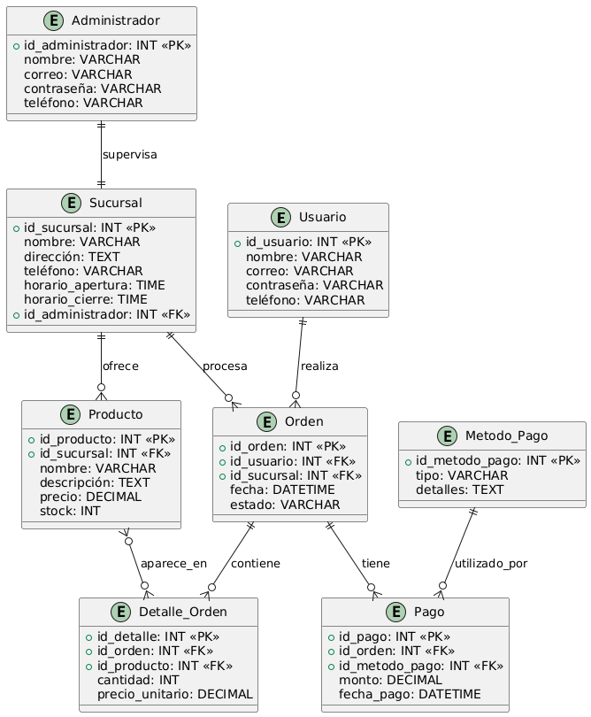

### Diagrama entidad relacion de la DB
   

#### Script

```sql
USE master;
GO
    
CREATE DATABASE WacDonaldsDB;
GO
USE WacDonaldsDB;
GO

-- Tabla Usuario
CREATE TABLE Usuario (
    id_usuario INT IDENTITY(1,1) PRIMARY KEY,
    nombre VARCHAR(100) NOT NULL,
    correo VARCHAR(100) UNIQUE NOT NULL,
    contraseña VARCHAR(255) NOT NULL,
    teléfono VARCHAR(20)
);
GO

-- Tabla Administrador
CREATE TABLE Administrador (
    id_administrador INT IDENTITY(1,1) PRIMARY KEY,
    nombre VARCHAR(100) NOT NULL,
    correo VARCHAR(100) UNIQUE NOT NULL,
    contraseña VARCHAR(255) NOT NULL,
    teléfono VARCHAR(20)
);
GO

-- Tabla Sucursal
CREATE TABLE Sucursal (
    id_sucursal INT IDENTITY(1,1) PRIMARY KEY,
    nombre VARCHAR(100) NOT NULL,
    dirección TEXT NOT NULL,
    teléfono VARCHAR(20),
    horario_apertura TIME,
    horario_cierre TIME,
    id_administrador INT,
    FOREIGN KEY (id_administrador) REFERENCES Administrador(id_administrador)
);
GO

-- Tabla Producto
CREATE TABLE Producto (
    id_producto INT IDENTITY(1,1) PRIMARY KEY,
    id_sucursal INT NOT NULL,
    nombre VARCHAR(100) NOT NULL,
    imagen_url VARCHAR(255),
    descripción TEXT,
    precio DECIMAL(10, 2) NOT NULL,
    stock INT NOT NULL DEFAULT 0,
    FOREIGN KEY (id_sucursal) REFERENCES Sucursal(id_sucursal)
);
GO

-- Tabla Orden
CREATE TABLE Orden (
    id_orden INT IDENTITY(1,1) PRIMARY KEY,
    id_usuario INT NOT NULL,
    id_sucursal INT NOT NULL,
    fecha DATETIME NOT NULL DEFAULT GETDATE(),
    estado VARCHAR(50) NOT NULL DEFAULT 'Pendiente',
    FOREIGN KEY (id_usuario) REFERENCES Usuario(id_usuario),
    FOREIGN KEY (id_sucursal) REFERENCES Sucursal(id_sucursal)
);
GO

-- Tabla Detalle_Orden
CREATE TABLE Detalle_Orden (
    id_detalle INT IDENTITY(1,1) PRIMARY KEY,
    id_orden INT NOT NULL,
    id_producto INT NOT NULL,
    cantidad INT NOT NULL,
    precio_unitario DECIMAL(10, 2) NOT NULL,
    FOREIGN KEY (id_orden) REFERENCES Orden(id_orden),
    FOREIGN KEY (id_producto) REFERENCES Producto(id_producto)
);
GO

-- Tabla Metodo_Pago
CREATE TABLE Metodo_Pago (
    id_metodo_pago INT IDENTITY(1,1) PRIMARY KEY,
    tipo VARCHAR(50) NOT NULL,
    detalles TEXT
);
GO

-- Tabla Pago
CREATE TABLE Pago (
    id_pago INT IDENTITY(1,1) PRIMARY KEY,
    id_orden INT NOT NULL,
    id_metodo_pago INT NOT NULL,
    monto DECIMAL(10, 2) NOT NULL,
    fecha_pago DATETIME NOT NULL DEFAULT GETDATE(),
    CONSTRAINT fk_pago_orden FOREIGN KEY (id_orden) REFERENCES Orden(id_orden) ON DELETE CASCADE ON UPDATE CASCADE,
    CONSTRAINT fk_pago_metodo FOREIGN KEY (id_metodo_pago) REFERENCES Metodo_Pago(id_metodo_pago) ON DELETE NO ACTION ON UPDATE CASCADE
);
GO
